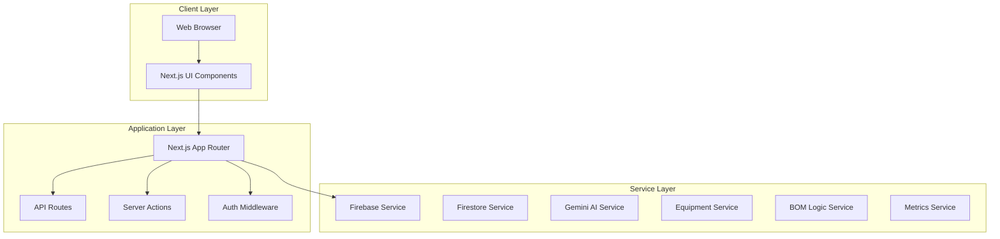
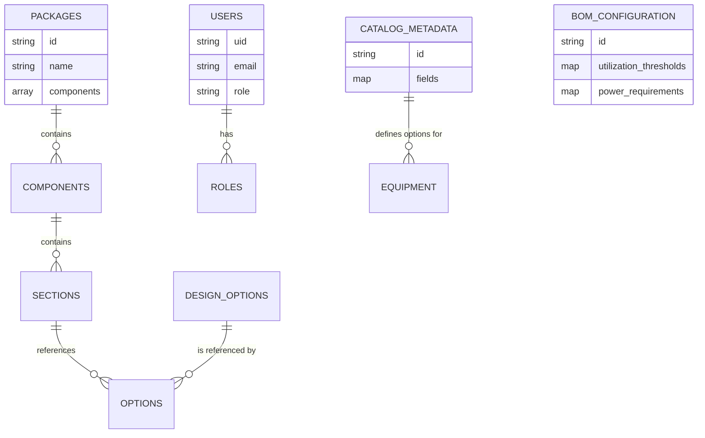
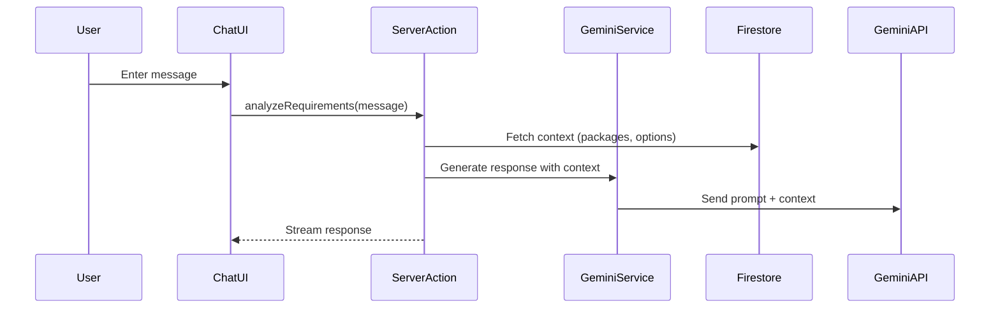
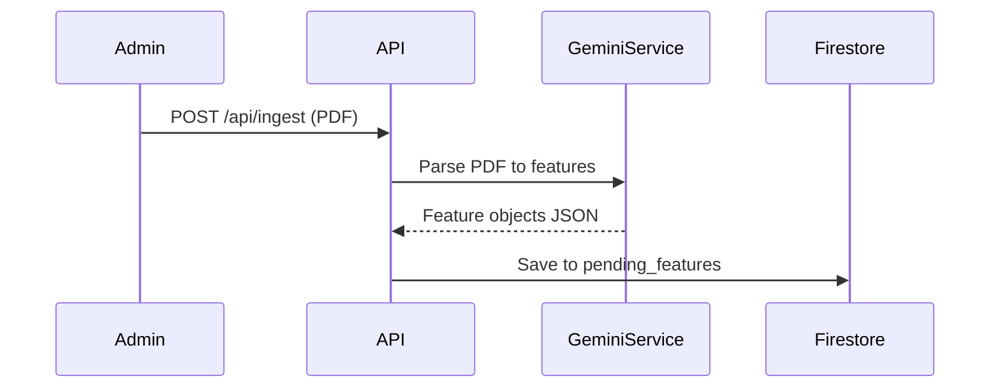

# ARCHITECTURE.md - System Design Map

## 🏗 High-Level Architecture
ZippyDesignBuilder is a **Next.js 16 Web Application** designed for high-performance design and package management.



### Directory Structure
- `src/app`: App Router pages and layouts.
- `src/components`: Reusable UI elements.
- `src/services`: Business logic and DB interaction (Firestore, Gemini, Equipment, BOM Logic).
- `src/lib`: Utilities and helpers (`utils.ts`, `firebase.ts`).
- `src/context`: React Context providers (Auth, Theme).

## 🧱 Data Model (Firestore)


## 🔄 Core Data Flows

### 1. AI Design Generation


### 2. PDF Spec Ingestion


## 🧱 Key Patterns
- **Server Actions**: Use for form submissions and mutations.
- **Client Components**: access Firebase via Hooks or passed-down data.
- **Styling**: All styles must use `index.css` variables or Tailwind utilities.

## 🔄 State Management
- Prefer **Local State** (`useState`, `useReducer`) for component-specific logic.
- Use **Context** only for truly global data (User Session, Theme, Toast Notifications).

## 🎓 Engineering Lessons & Patterns

### 1. Firestore Sub-collection Security
- **Lesson**: Sub-collections (e.g., `/customer_designs/{id}/versions`) do not automatically inherit parent document permissions in many rule configurations.
- **Pattern**: Use `get()` in `firestore.rules` to verify parent document ownership. This ensures that even empty sub-collections can be safely queried/added to by the owner.
  ```javascript
  match /subcollection/{id} {
    allow read, write: if get(/databases/$(database)/documents/parent/{parentId}).data.userId == request.auth.uid;
  }
  ```

### 2. State Restoration Strategy
- **Pattern**: When restoring a root document (e.g., `DesignProject`) from a snapshot (e.g., `DesignVersion`), always **strip metadata** (version numbers, separate IDs, snapshot dates) before the `updateDoc` call.
- **Goal**: Prevent the main document from adopting version-specific identities, ensuring `updatedAt` is the only timestamp that changes on the root.

### 3. Scaling History (Sub-collections vs Arrays)
- **Lesson**: Storing project history inside the main document (as an array) risks hitting Firestore's **1MB document limit**.
- **Pattern**: Implement versioning as a **Firestore Sub-collection**. This provides infinite history scaling and allows fetching history only when the user explicitly requests the "Version History" modal, reducing initial page load weight.

### 4. Deterministic Snapshots
- **Pattern**: When "Finalizing" a design, clone the equipment/service data *into* the design document. This protects the project from future catalog changes (e.g., a device being discontinued) while keeping the original historical record accurate for engineering/procurement.

### 5. Logic as Data (BOM Configuration)
- **Lesson**: Hardcoding domain logic thresholds (e.g., bandwidth utilization limits or power requirements) creates technical debt and limits adaptability.
- **Pattern**: Move these values into a centralized `BomConfiguration` stored in Firestore. Refactor services (like `BOMLogicService`) to be **stateful and config-aware**, enabling non-technical administrators to tune the platform's behavior without code changes.

### 6. Unified Service Catalog (Stable ID Sync)
- **Lesson**: Data drift between hardcoded seed data and a dynamic "Unified Catalog" is a common source of bugs.
- **Pattern**: When seeding data templates (like Packages), always include the **Stable IDs** of the master catalog items. This allows for resilient, ID-based matching during runtime, preventing "ghost" references when display names or descriptions are updated by administrators.

### 7. Dynamic Metadata Management
- **Lesson**: Hardcoding dropdown options (e.g., Interface Types, Form Factors) requires code deployments for simple business data changes.
- **Pattern**: Store all UI "choice" data in a `catalog_metadata` collection.
    - **Implementation**: The `useCatalogMetadata` hook fetches these options on component mount.
    - **Benefit**: Admins can add new "Recommended Use Cases" or "Mounting Options" via the Admin UI, and these immediately propagate to:
        1. The Equipment Editor UI.
        2. The AI Ingestion Prompt (as validation rules).
        3. The Filter/Search panels.
