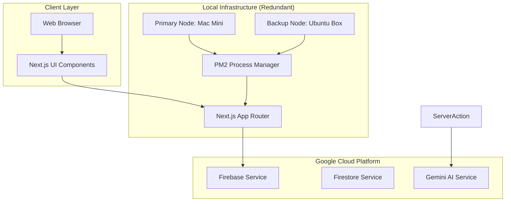
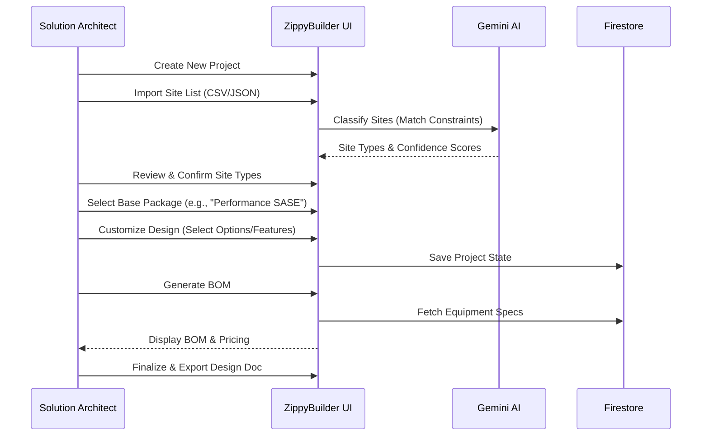
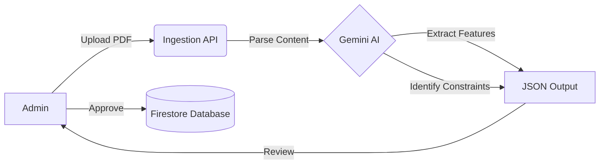
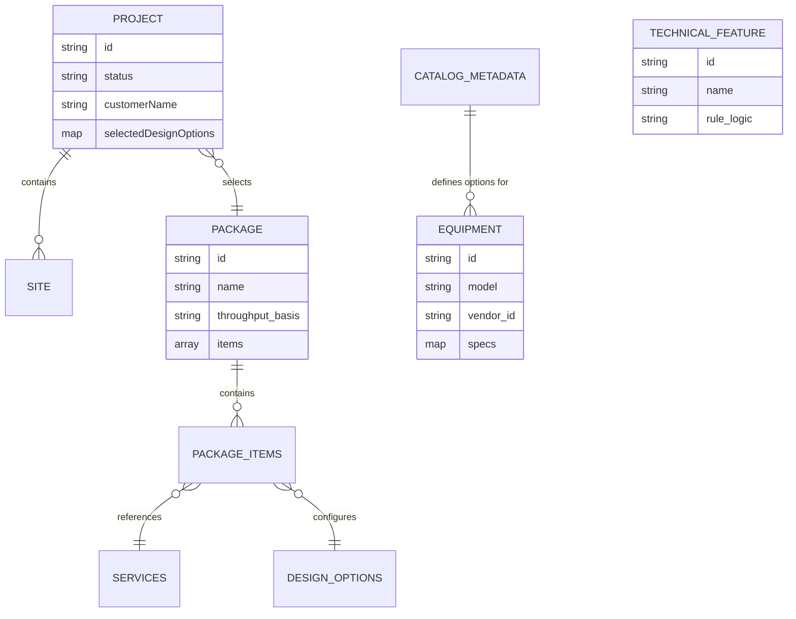

# ZippyDesignBuilder v2 - Technical Overview

## 1. Executive Summary

ZippyDesignBuilder v2 is a modern, high-performance web application designed to streamline the process of network design and package management. Built on Next.js 16 and Google Cloud Platform, it leverages Generative AI (Google Gemini) to automate complex tasks like site classification and technical specification extraction. The system serves two primary user personas: **Administrators**, who manage the service catalog and rules, and **Solution Architects (SAs)**, who use the tool to generate standardized network designs and Bills of Materials (BOMs).

## 2. System Architecture

The application follows a redundant self-hosted architecture, with backend services provided by Google Firebase and Gemini.

### High-Level Architecture Diagram

### Technology Stack
- **Frontend Framework**: Next.js 16 (React 19, Server Components).
- **Styling**: TailwindCSS v4 with a custom design system.
- **Backend/Database**: Google Firebase (Firestore for NoSQL data, Authentication for identity).
- **AI Engine**: Google Gemini 2.5 Flash via Google AI SDK.
- **Hosting/CI/CD**: Self-Hosted (Mac Mini + Ubuntu) with GitHub Actions.

## 3. Infrastructure & Deployment

The application utilizes a Git-based workflow with automated deployment to local hardware.

- **Source Control**: Git repository with a branching strategy (`main` for production, `develop` for pre-production).
- **Redundant Deployment Pipeline**:
    - **Primary Node**: Mac Mini (ARM64) - Handles primary traffic and high-speed builds.
    - **Backup Node**: Ubuntu dev-box (x64) - Provides high availability redundancy.
- **Automation**: GitHub Actions manages the build and deployment process. The pipeline is resilient; a failure on one node does not stop deployment to the other.
- **Environment Management**: Configuration is handled via local `.env.local` files on each node, securely storing API keys (Firebase, Gemini) and deployment-specific settings.

## 4. Key Functionalities

### Administrator Functions
- **Service Catalog Management**: Define Services, Service Options, and Design Options.
- **Package Management**: Create and maintain "Packages" (bundles of services/options) with associated collateral.
- **Equipment Library**: Manage a database of network devices (routers, switches, APs) with detailed technical specifications.
- **AI Ingestion**: Upload PDF datasheets to automatically extract and populate technical features using Gemini.
- **Metadata Management**: Dynamically update dropdown options (e.g., Interface Types, Deployment Roles) without code changes.

### Solution Architect (SA) Functions
- **Project Wizard**: A step-by-step flow to create a network design for a customer.
- **Site Classification**: Import a list of sites and use AI to automatically map them to defined "Site Types" based on constraints (user count, bandwidth, redundancy).
- **Design Customization**: Select a base Package and toggle features/options to tailor the solution.
- **BOM Generation**: Automatically generate a Bill of Materials based on the selected design and site requirements.
- **Design Documentation**: Generate a comprehensive design document and technical summary.

## 5. Workflows

### Solution Architect (SA) Workflow
The core value stream involves an SA moving from raw customer data to a finished design.

### Admin Data Ingestion Workflow
Admins keep the system up-to-date by ingesting new technical capabilities.

## 6. Data Models

The application uses a flexible NoSQL schema in Firestore.

### Entity Relationship Diagram

- **Project**: The root object for an SA's work. Stores the customer info, site list, and the *delta* of customizations applied to the base package.
- **Package**: A template definition. It doesn't store state, but references `Services` and `DesignOptions`.
- **Equipment**: Stores physical device specifications. Crucially, it includes fields like `ngfw_throughput_mbps` and `vpn_throughput_mbps` used for BOM calculations.
- **Catalog Metadata**: A "meta-collection" that stores the valid values for dropdowns (e.g., "Wi-Fi 6", "1U Rack Mount"). This allows the UI to be dynamic.

## 7. AI Integration (Gemini)

The system leverages **Google Gemini 2.5 Flash** for high-speed, cost-effective inference.

### Key AI Use Cases

1.  **AI Design Analysis & Package Recommendation**:
    -   **Problem**: SAs often struggle to quickly map complex customer requirements documents to the most appropriate service bundle.
    -   **Solution**: SAs can upload a "Requirements PDF" or paste specific text. The AI analyzes these requirements against the entire **Service Package Catalog** and recommends the best-fitting package with a confidence score and detailed technical reasoning.

2.  **Smart Site Classification**:
    -   **Problem**: Matching hundreds of customer sites to standardized profiles (e.g., "Small Branch", "Regional Hub") is tedious and error-prone.
    -   **Solution**: The AI analyzes site attributes (User Count, Bandwidth, Redundancy) against the *strict constraints* and *descriptions* of defined Site Types. It outputs a classification with a confidence score and reasoning (e.g., "Matched 'Large Office' because user count > 100").

3.  **Interactive Design Consultant**:
    -   **Problem**: Complex design questions ("How do I handle East-West security with Meraki?") require deep domain expertise.
    -   **Solution**: An AI-powered "SA Consultant" stays with the user throughout the project. It has full context of the customer requirements, available packages, and services, allowing it to provide tailored architectural advice and justify design decisions.

4.  **Admin: PDF Datasheet Ingestion**:
    -   **Problem**: Manually entering technical specs from vendor PDFs is slow and prone to data entry errors.
    -   **Solution**: Admins upload an equipment datasheet. Gemini extracts "Technical Features", "Caveats", and "Assumptions" into a structured JSON format that matches the system's `TechnicalFeature` schema, significantly accelerating catalog updates.

## 8. Usage Scale & Enterprise Readiness

### Construction Usage Scale
-   **User Base**: The current architecture (Vercel + Firestore) can easily support **thousands of concurrent users**. Firestore handles massive read/write throughput (up to 1M concurrent connections).
-   **Data Volume**: Firestore scales automatically. The "Sub-collection" pattern (see Architecture) ensures individual documents don't hit the 1MB limit as projects grow.
-   **AI Quotas**: Usage of Gemini API is subject to Google Cloud quotas. For enterprise scale, a dedicated provisioned throughput or tiered API plan would be required.

### Path to Enterprise Readiness
To graduate from a "Construction/Tooling" app to a full Enterprise Platform, the following are recommended:

1.  **Single Sign-On (SSO)**:
    -   *Current*: Email/Password (Firebase Auth).
    -   *Required*: Integrate with Enterprise IdPs (Azure AD, Okta) using Firebase Authentication SAML/OIDC provider support.

2.  **Role-Based Access Control (RBAC)**:
    -   *Current*: Basic User/Admin separation.
    -   *Required*: Granular permissions (e.g., "Viewer", "Editor", "Approver"). This can be implemented using Custom Claims in Firebase Auth and enforced via Firestore Security Rules.

3.  **Audit Logging**:
    -   *Required*: A comprehensive audit trail of *who* changed *what* (especially for Packages and Pricing). Implement using Firestore Triggers (Cloud Functions) writing to a separate `audit_logs` collection or BigQuery.

4.  **Compliance & Security**:
    -   Data Residency controls (if deploying to specific GCP regions).
    -   SOC2/ISO compliance checks for the hosting environment.

5.  **Environment Isolation**:
    -   Strict separation of `dev`, `staging`, and `prod` Firebase projects to prevent data contamination.
